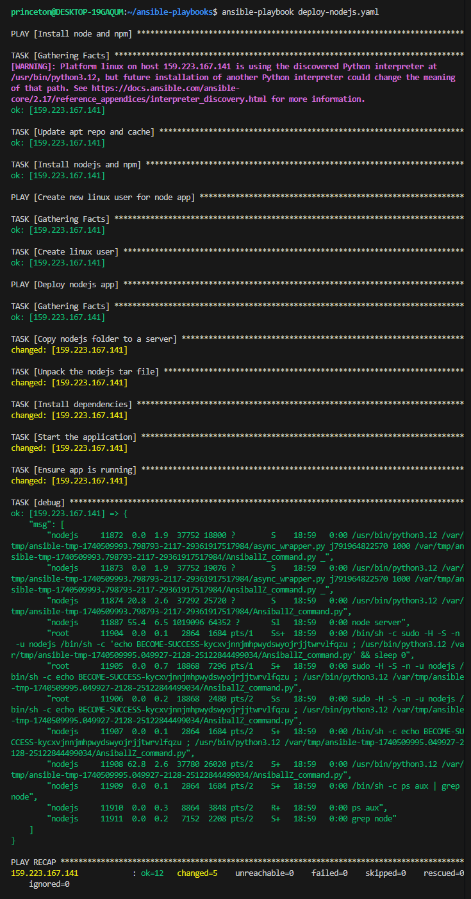

# Automating Node.js Application Deployment

## Project Overview

This project demonstrates how I automated the deployment of a Node.js application using Ansible on a DigitalOcean droplet. The automation handles, dependency installation, user creation, and application deployment.

## Technologies Used

- **Ansible**: For automation and configuration management
- **Node.js**: Runtime for the web application
- **DigitalOcean**: Cloud hosting provider
- **Linux**: Operating system for the server

## Implementation Steps

### 1. Server Creation

I created a new Ubuntu server on DigitalOcean and configured SSH access for secure remote management.

 <!-- Suggestion: Screenshot of DigitalOcean dashboard with created droplet -->

### 2. Ansible Configuration

I wrote an inventory file to define the server details and connection parameters for Ansible.

 <!-- Suggestion: Code screenshot of inventory file -->

### 3. Playbook Development

I created an Ansible playbook that:
- Installs Node.js and npm dependencies
- Creates a dedicated Linux user for running the application
- Copies a Node.js tar file (which contains the application), unpacks the file and then starts the application
- Verifies that the App is successfully running.

 <!-- Suggestion: Code screenshot of main playbook file -->

### 4. Application Deployment

My playbook handles:
- Cloning the Node.js application code from the repository
- Installing dependencies via npm
- Setting up environment variables
- Configuring the application to run as a service

 <!-- Suggestion: Diagram showing deployment workflow -->

### 6. Execution Results

After running the playbook, the application was successfully deployed and accessible via the configured port.

 <!-- Suggestion: Screenshot of running application -->

